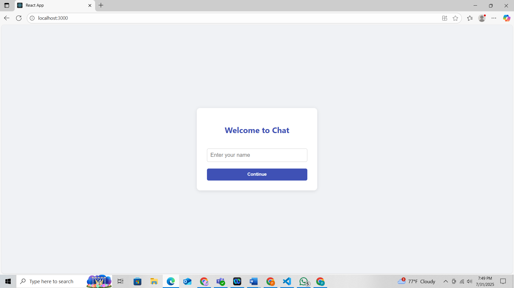
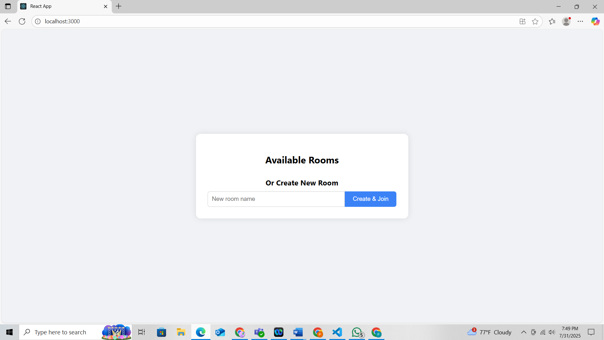
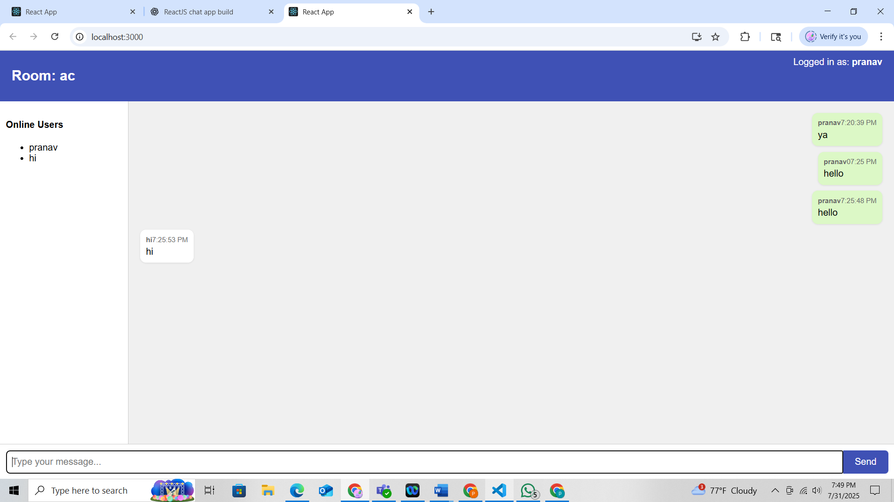

# 🗨️ Real-Time Chat App

A clean, simple real-time chat application built with **React**, **TypeScript**, **Socket.IO**, and **Node.js**. Supports multi-user chat rooms, live messaging, and responsive design.

---

## 🚀 Features

- Join or create chat rooms
- Real-time messaging using Socket.IO
- Timestamped messages
- Online users list per room
- Styled responsive UI (single-file styling)
- Works across browsers

---

## 🛠️ Tech Stack

| Frontend  | Backend            | Realtime  | Styling          |
|-----------|--------------------|-----------|------------------|
| React     | Node.js + Express  | Socket.IO | Inline CSS (JSX) |
| TypeScript |                    |           |                  |

---

## 📦 Installation

### 1. Clone the repo

```bash
git clone https://github.com/your-username/realtime-chat.git
cd realtime-chat
```

### 2. Start the server

```bash
cd server
npm install
node index.js
```

### 3. Start the client

```bash
cd ../client
npm install
npm start
```

---

## 📷 Screenshots

### 1. Welcome Page


### 2. Room Selection


### 3. Chatroom Interface


---

## 🛠️ How to Run Locally

1. Clone the repo  
   ```bash
   git clone https://github.com/your-username/realtime-chat.git
   cd realtime-chat
   ```

2. Start the backend server  
   ```bash
   cd server
   npm install
   node index.js
   ```

3. Start the frontend app  
   ```bash
   cd ../client
   npm install
   npm start
   ```

Now open your browser at [http://localhost:3000](http://localhost:3000) and start chatting.

---

## 📁 Folder Structure

```
realtime-chat/
├── client/             # React + TypeScript frontend
├── server/             # Express + Socket.IO backend
├── Screenshots/        # UI screenshots for README
└── README.md
```

---

## 📜 License

This project is open source and available under the [MIT License](LICENSE).
